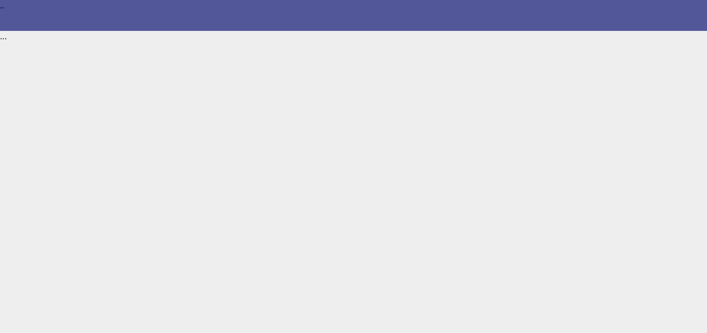
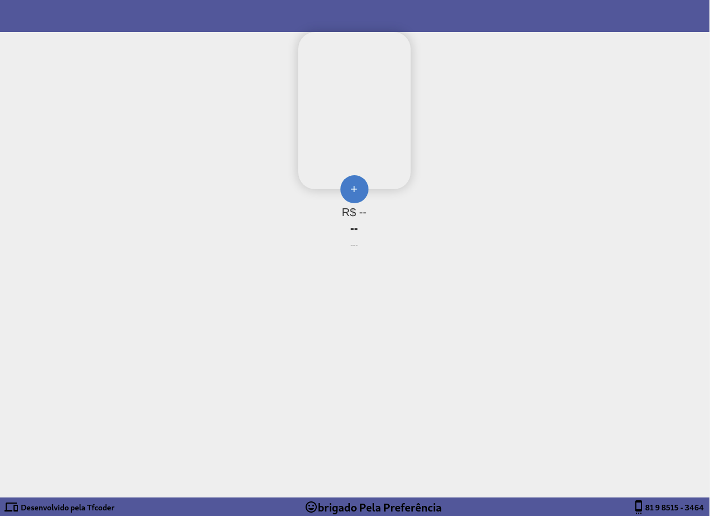

### Projeto <b>AguaParaTodos</b> aplicação responsável por toda parte de venda online de aguá mineral.

- A primeira parte desse projeto vai ser o frontend, usando a tecnologia (REACJS)

- Dentro do <b>README</b> da pasta do projeto está tudo que foi ou está sendo usando.
https://github.com/thiagoadssilva/youtubeClone/blob/main/clone/README.md

-  Para visualizar o projeto 

## <b>Header e Body</b> 

## Finalizado o radaPé e iniciando o laytou dos itens. 

